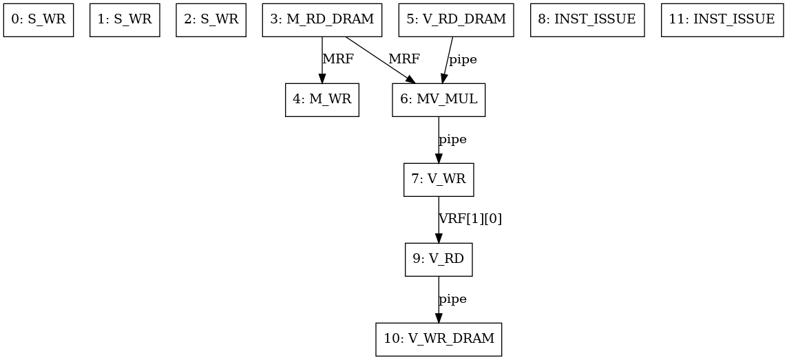
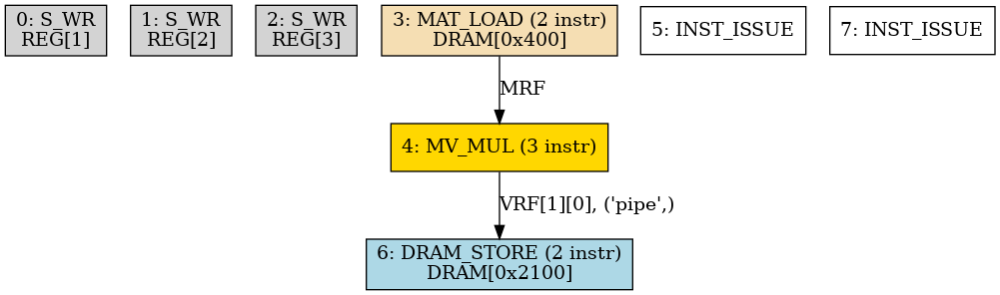
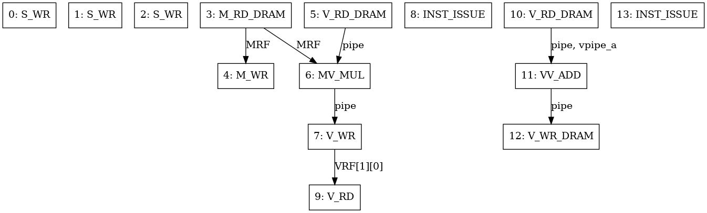
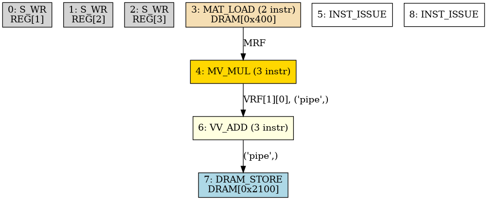
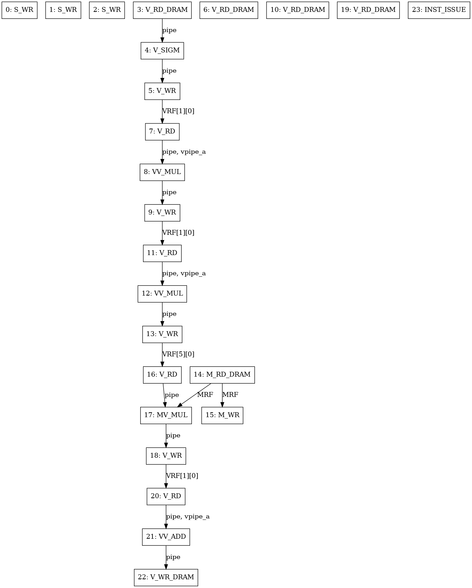
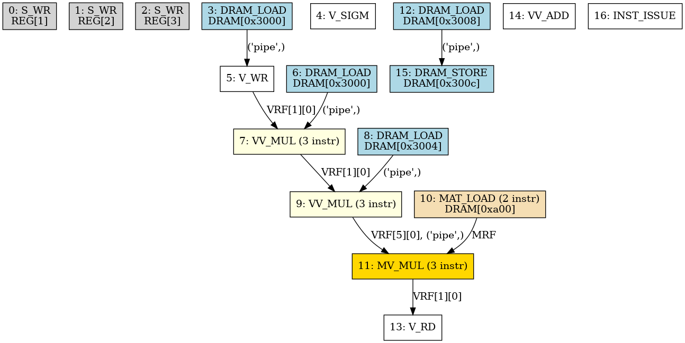
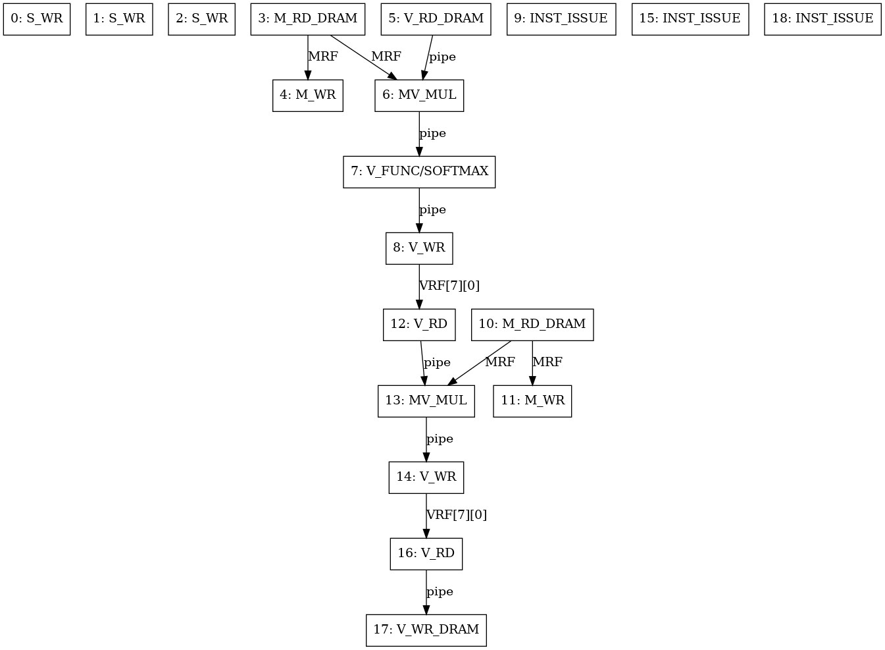
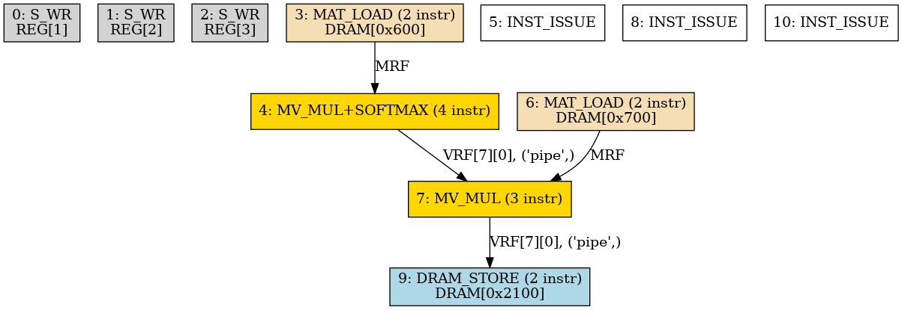

# NPU Chain Examples

Demonstrates single-chain and multi-chain firmware patterns using
the chain-aware dispatch API (`npu_issue_chain` + `npu_wait_chain`).

## Background

A **chain** is a group of consecutive NPU instructions committed
atomically via `OP_INST_ISSUE` (opcode 45).  Within a chain:

- Instructions flow into the FIFO **without per-instruction stalls**
  (`npu_send_inst` no longer polls `NPU_STATUS_FULL`).
- The **pipeline register** threads values between instructions:
  `V_RD` loads a vector into the pipe, compute ops transform it,
  `V_WR` stores it to VRF/DRAM **while keeping the value in the
  pipe** (broadcast semantics).
- `V_WR` / `V_WR_DRAM` do **not** consume the pipeline — subsequent
  instructions can still read it via `V_RD` (which saves the old
  pipeline to `vpipe_a` for binary ops).
- `V_RD` loads a new value and saves the previous pipeline to
  `vpipe_a` (the first operand for `VV_ADD`, `VV_MUL`, etc.).
- `INST_ISSUE` **discards the pipeline** — values do not persist
  across chain boundaries.

## Implicit vs Explicit Operands

NPU instructions reference operands in two ways:

| Operand | Source | Used by |
|---------|--------|--------|
| **MRF** (explicit) | Loaded by `M_RD_DRAM` or `M_RD` (row buffer) | `MV_MUL` only |
| **pipeline** (implicit) | Set by most recent `V_RD` / `V_RD_DRAM` | `MV_MUL`, `VV_*`, `V_*` activations, `V_WR`, `V_WR_DRAM` |
| **vpipe_a** (implicit) | Saved by `V_RD` / `V_RD_DRAM` (old pipeline) | `VV_ADD`, `VV_MUL`, etc. (binary ops) |
| **SRF** (explicit) | Written by `OP_S_RECIP`, `OP_S_SQRT` etc. | `MEM_SPU_BROADCAST` |

`MV_MUL` is unique: it takes **one explicit operand** (MRF, set by the
preceding `M_RD_DRAM`) and **one implicit operand** (pipeline, set by the
preceding `V_RD`/`V_RD_DRAM`).  The instruction word itself encodes
neither source — it is the *ordering* of instructions in the chain that
guarantees MRF and pipeline hold the correct values.

This is why the single-chain example in `01_single_chain.c` avoids
unnecessary `V_WR(IVRF) → V_RD(IVRF)` round-trips — the vector lives
in the pipeline from `V_RD_DRAM` straight into `MV_MUL`.

Across chains:

- `INST_ISSUE` commits all preceding instructions for parallel
  dispatch (in the RTL).  The emulator models this by clearing
  `CHAIN_STATUS` to 0.
- `npu_wait_chain()` polls `NPU_CHAIN_STATUS` (register `0x0C`)
  until all functional units (VMM, MMM, MVU) are idle.
- **SMC** (Simultaneous Multi-Chaining): independent chains
  (no RAW/WAR hazards) can run concurrently in the RTL.

## CHAIN_STATUS bit assignments

| Bit | Unit | Instructions |
|-----|------|-------------|
| 0 | VMM | `V_RD`, `V_WR`, `V_RD_DRAM`, `V_WR_DRAM`, `VV_*`, `V_*` (activations), `V_FUNC` |
| 1 | MMM | `M_RD_DRAM`, `M_RD` (VecToMatRow → MRF), `M_WR_DRAM` |
| 2 | MVU | `MV_MUL` |

The pipeline register itself is not a functional unit — it is a data
path that all instructions pass through.  It is never independently
"busy" and is therefore not tracked in CHAIN_STATUS.

## File Reference

### `01_single_chain.c`

A single MVM (matrix-vector multiply) in one chain group:

```
M_RD_DRAM → M_WR → V_RD_DRAM → V_WR/IVRF → V_RD/IVRF → MV_MUL → V_WR/MPV
├───────────────────── MMM ─────────────────────┤
├───────── VMM (load) ─────────┤├── MVU ──┤├─ VMM (store) ─┤
                                                      INST_ISSUE
                                                      wait_chain
```

Then a second chain reads the VRF result and writes it to DRAM.

### `02_multi_chain.c`

**Chain 1** — MVM: `W × X → MULTIPLY_VRF`

**Chain 2** — Bias add: `W×X + bias → DRAM`

Also contains `silu_mvm_residual_chain()`, a reference implementation
of one position's two-phase FFN computation,
as a single chain group (15 instructions).

### `03_softmax_chain.c`

Demonstrates `V_FUNC(SOFTMAX)` chained in-line with `MV_MUL` via the
implicit pipeline.  The softmax output flows directly into the `V_WR`
without an intermediate DRAM save.

**Chain 1** — Q × K.T → scores → softmax (MRF = K.T, pipe = Q):
```
M_RD_DRAM(K.T) → M_WR → V_RD_DRAM(Q) → MV_MUL → V_FUNC(SOFTMAX) → V_WR
├──── MMM ─────┤├─────────── VMM (load) ──────────┤├ MVU ─┤├ V_FUNC ┤├ VMM ┤
                                                                  INST_ISSUE
                                                                  wait_chain
```

**Chain 2** — attn × V → context (MRF = V, pipe = attn from VRF):
```
M_RD_DRAM(V) → M_WR → V_RD(attn) → MV_MUL → V_WR
├─── MMM ────┤├── VMM ──┤├ MVU ┤├ VMM ┤
```

**Chain 3** — Context write to DRAM.

Key insight: `V_FUNC(SOFTMAX)` reads the pipeline (scores from MV_MUL),
applies softmax, and writes the result back to the pipeline — so the
next instruction (V_WR) sees the attention weights immediately.  No
DRAM save-load round-trip between scoring and softmax.

The MRF holds **K.T** in chain 1 and **V** (not V.T) in chain 2.
Since MV_MUL computes MRF × pipeline, chain 2 computes V × attn,
which is the correct context vector = weighted sum of value rows.

### `chain_dag.py`

Generates def-use DAG diagrams showing tensor flow through the chain
examples.  Produces both event-level DAG (every instruction as a node)
and a collapsed micro-op DAG (load-compute-store groups).

Running the script replays the single-chain and SiLU-chain instruction
sequences through the emulator's `EventTracer` and writes DOT files
that can be rendered with Graphviz:

```bash
PYTHONPATH=. python3 firmware/examples/chain_dag.py --output /tmp/chain_dag/
# Render DOT to PNG:
dot -Tpng /tmp/chain_dag/chain_example_events.dot -o chain_events.png
dot -Tpng /tmp/chain_dag/chain_example_microops.dot -o chain_microops.png
dot -Tpng /tmp/chain_dag/silu_chain_microops.dot -o silu_chain_microops.png
dot -Tpng /tmp/chain_dag/silu_chain_events.dot -o silu_chain_events.png
dot -Tpng /tmp/chain_dag/multi_chain_events.dot -o multi_chain_events.png
dot -Tpng /tmp/chain_dag/multi_chain_microops.dot -o multi_chain_microops.png
dot -Tpng /tmp/chain_dag/softmax_chain_events.dot -o softmax_chain_events.png
dot -Tpng /tmp/chain_dag/softmax_chain_microops.dot -o softmax_chain_microops.png
```

### Generated DAG Diagrams

Pre-rendered diagrams are available in `firmware/examples/_dag/`:

| Diagram | Dot File | Description |
|---------|----------|-------------|
|  | `chain_example_events.dot` | Event-level DAG of `01_single_chain.c` — every instruction as a node, edges show data flow (MRF → MV_MUL, pipe → MV_MUL, pipe → V_WR) |
|  | `chain_example_microops.dot` | Collapsed micro-op DAG — MAT_LOAD → MV_MUL → DRAM_STORE groups |
|  | `multi_chain_events.dot` | Two-chain sequence from `02_multi_chain.c` — Chain 1 (MVM) followed by Chain 2 (bias add) |
|  | `multi_chain_microops.dot` | Micro-op DAG across two chains — VRF[1][0] data dependency bridges the INST_ISSUE boundary |
|  | `silu_chain_events.dot` | Event-level DAG of the SiLU × up → W_down → residual chain — 24 instructions with full def-use edges |
|  | `silu_chain_microops.dot` | Collapsed micro-op DAG of the same chain — 21 instructions collapsed to 9 micro-ops |
|  | `softmax_chain_events.dot` | Event-level DAG of `03_softmax_chain.c` — Chain 1: Q×K.T → scores → softmax → attn. Chain 2: attn × V → context. Chain 3: DRAM write. |
|  | `softmax_chain_microops.dot` | Micro-op DAG — SOFTMAX is a standalone node between MV_MUL(K.T×Q) and MV_MUL(V×attn). MRF holds K.T then V. |

The event-level DAG shows MV_MUL with two incoming edges — one `via MRF`
(the explicit operand from the preceding `M_RD_DRAM`) and one `via pipe`
(the implicit operand from the preceding `V_RD_DRAM`).  Each edge is
labeled with the resource name, making the dataflow explicit.

Example output (event-level):
```
  3 M_RD_DRAM          defs=[(MRF,)]          uses=[(DRAM, 1024)]
  4 M_WR               defs=[]                uses=[(MRF,)]
  5 V_RD_DRAM          defs=[(pipe,), ...]     uses=[(DRAM, 8192)]
  6 MV_MUL             defs=[(pipe,)]          uses=[(pipe,), (MRF,)]
    <- [3 M_RD_DRAM] via MRF       ← explicit
    <- [5 V_RD_DRAM] via pipe      ← implicit
  7 V_WR               defs=[(VRF, 1, 0)]      uses=[(pipe,)]
  8 INST_ISSUE
  9 V_RD               defs=[(pipe,), ...]      uses=[(VRF, 1, 0)]
 10 V_WR_DRAM          defs=[(DRAM, 8448)]     uses=[(pipe,)]
 11 INST_ISSUE
```

## Build

These examples use the same Makefile infrastructure as the existing
firmware.  Build with:

```bash
cd firmware
make TARGET=examples/01_single_chain BUILD_DIR=build_examples
make TARGET=examples/02_multi_chain BUILD_DIR=build_examples
make TARGET=examples/03_softmax_chain BUILD_DIR=build_examples
```

## Key API

| Function | Purpose |
|----------|---------|
| `npu_send_inst(inst)` | Push one instruction — no FIFO stall |
| `npu_issue_chain()` | Send `OP_INST_ISSUE` to commit current chain |
| `npu_wait_chain()` | Poll `NPU_CHAIN_STATUS` until all units idle |
| `npu_wait_done()` | Legacy — use chain API instead |
