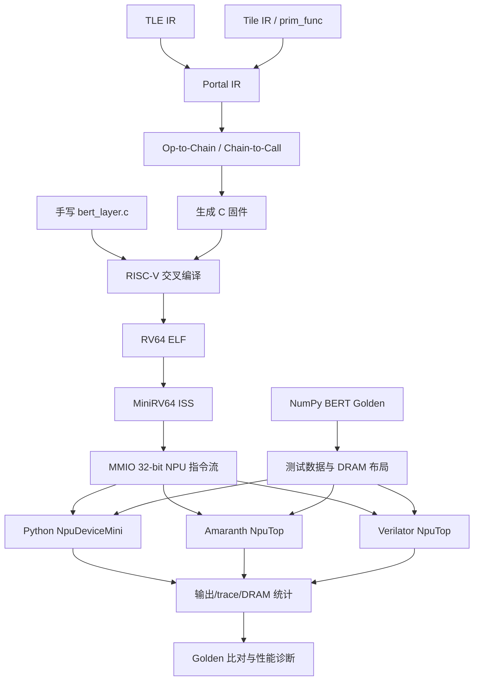
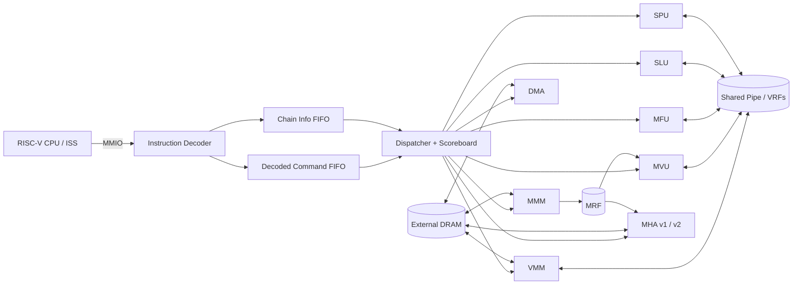
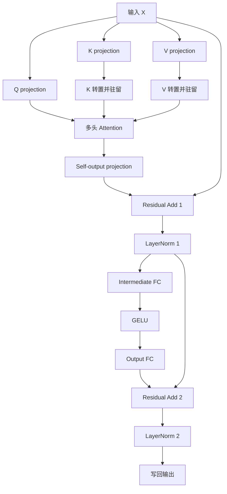

# 原始 `master` 项目完整分析报告

> **归档状态**：这是 2026-08-03 的上游 `master` 快照分析，用于迁移取证；它不描述当前 v10 闭环的实时能力。当前状态请以 [`../project-status.zh.md`](../project-status.zh.md) 为准。

> 分析对象：`<workspace>/rv-npu.gitee-repo`
> 分支：`master`（与 `origin/master` 一致，工作树干净）
> 基准提交：`cc05ffc7098a946d6368db1f14901498b702bccd`
> 提交日期：2026-08-05
> 分析日期：2026-08-10
> 报告目的：解释原始 master 的项目定位、目录结构、软硬件功能、运行机制、验证体系、性能分析能力、实现进度和接手风险，并为后续把 v10/JIMU 工作移植回 master 提供基线。

---

## 1. 结论先行

原始 master 不是一个只包含 NPU RTL 的硬件仓库，也不是一个已经产品化的 BERT 推理框架。它更准确的定位是：

**一个围绕 BERT Encoder Layer 建立的 FPGA NPU 软硬件协同设计、验证与设计空间探索平台。**

它已经形成四条相互贯通的技术链：

1. **模型与编译链**：用 Portal IR、TLE IR、Tile IR 和简化的 `@prim_func` 前端描述 BERT 图，再降低为固件 C 代码。
2. **固件链**：RISC-V 裸机固件通过 MMIO 向 NPU 下发 32 位指令，既支持软件分解的 attention，也支持 MHA v1、MHA v2、DMA 和多链调度等实验路径。
3. **硬件与模拟链**：同一份固件可在 Python 功能模拟器、Amaranth RTL 仿真和部分 Verilator RTL 模型中运行。
4. **验证与性能链**：从 NumPy golden、ISS+模拟器、RTL 顺序/批量/旁路，到理想数据通路模型、NoC 调度模型和性能下界工具，构成多层验证和诊断体系。

原始 master 的主要价值不是“已经达到最高性能”，而是提供了一个可以观察每层行为、替换某个硬件单元或固件路径、再用同一套测试闭环验证的研究平台。

### 1.1 当前成熟度判断

| 子系统 | 成熟度 | 判断 |
|---|---:|---|
| Python golden 与小规模 BERT E2E | 较高 | 固定随机种子、多个形状、输出比对和 opcode 覆盖已建立 |
| RISC-V 固件与 MiniRV64 ISS | 较高 | 可以编译 ELF、执行固件、驱动 MMIO NPU |
| Python NPU 功能模拟器 | 较高 | 覆盖主 ISA、MHA v1/v2、DMA，并有 trace/统计能力 |
| Amaranth RTL 功能验证 | 中高 | 核心单元和 NpuTop 有较完整仿真，但容差与覆盖仍非产品级 |
| BERT 固件通用性 | 中 | 支持 tile 化和若干模式，但验证集中在很小的 dim/seq 配置 |
| DSL/编译器 | 中低到中 | 端到端路径存在，但 IR、pass 和前端仍偏原型化、BERT 专用化 |
| MHA v1/v2、DMA | 中 | 已接入若干验证路径，但不同后端和测试轮次覆盖并不对称 |
| Dispatcher-NoC | 中低 | Python 调度探索和 HDL bridge 可用，但不是物理数据 NoC，也未形成最终综合实现 |
| Verilator/EDA | 中低 | 可以生成 Verilog 和构建共享库；未看到特定板卡 bitstream、时序收敛和资源报告作为仓库基线 |
| 自动 agent 优化闭环 | 原 master 中不存在 | master 只有 agent-oriented DSE 的设计思想和分析工具，没有 v10 的 `jimu-dse` 闭环框架 |
| CI/工程发布 | 较低 | CI 文件引用了已删除/移动的测试路径，依赖与打包也未完全标准化 |

### 1.2 接手时最重要的五点

1. **实际代码优先于旧文档。** 54 份 Markdown 中有大量阶段计划和历史记录；README 较新，但 specification、firmware、HDL、IR、test 等文档有不同程度漂移。
2. **NoC 是控制面，不是张量数据面。** `emulator/dispatcher_noc.py` 探索的是指令发射和 FIFO 调度策略，数据仍通过 VRF/MRF/共享 pipe 流动。
3. **不同“周期”不能混算。** R4 旁路、Python NoC、DispatchBridge、R5 理想模型和理论 FLOP 下界测量的是不同层次。
4. **小配置通过不等于大模型可用。** 当前主回归集中在 `dim=2/4`、`seq_len=2/6`、`num_head=2`；它证明数据流和控制逻辑，不证明 BERT-base 规模部署。
5. **master 是 JIMU 的承载底座，不是 JIMU 本身。** 后续移植应保留 master 的软硬件验证链，再增量加入 v10 的基线、DAG、skill、结果门禁和 agent 编排。

---

## 2. 分析方法与证据优先级

本报告采用以下证据顺序：

1. 当前提交中的可执行代码、Makefile、测试参数和断言；
2. 当前 README 与组件 README；
3. architecture、build、firmware、HDL、IR、test、NoC、EDA 等主文档；
4. `docs/*-history/` 中的设计计划、实现记录和复盘；
5. 提交日志对功能演进顺序的佐证。

当文档和代码冲突时，本报告采用代码现状，并单独记录文档漂移。

### 2.1 仓库规模

按工作树统计，核心目录约有 **30,587 行 Python/C/C++/SystemVerilog 源码**，另有 **54 份 Markdown 文档**。源码规模分布如下：

| 目录 | 文件数 | 源码行数（约） | 主要性质 |
|---|---:|---:|---|
| `hdl/` | 63 | 9,848 | Amaranth RTL 与硬件组件 |
| `tests/` | 32 | 6,073 | 单元、集成、NoC、RTL 验证 |
| `dsl/` | 27 | 4,857 | IR、lowering、bridge、codegen |
| `emulator/` | 17 | 3,637 | NPU 功能模型、NoC、trace、Verilator 包装 |
| `tools/` | 19 | 3,519 | 周期、瓶颈、下界和诊断工具 |
| `firmware/` | 11 | 1,747 | 裸机启动、驱动、BERT 固件 |
| `iss/` | 2 | 314 | MiniRV64 指令集模拟器 |
| `sim/` | 4 | 328 | Verilator wrapper、DRAM 和 C++ 接口 |
| `scripts/` | 2 | 264 | Verilog 生成等辅助脚本 |

---

## 3. 项目定位与设计思想

### 3.1 研究目标

项目把 BERT Encoder Layer 当成贯穿软硬件栈的代表性负载，主要研究：

- 矩阵/向量/逐元素/归一化/attention 算子如何映射到专用单元；
- 固件如何把大 tensor 切成原生硬件 tile；
- 多条指令链如何并发发射并避免 VRF bank 冲突；
- attention 应由通用 MVU 软件展开，还是下沉到 MHA 专用单元；
- DMA、MRF 驻留、转置和 DRAM 布局如何影响流量；
- 控制调度网络、共享数据通路与计算单元各自贡献多少周期；
- 编译器中的硬件 hint 如何决定 Portal IR 到 Chain IR 的绑定。

### 3.2 主要设计来源

README 和设计文档提到的思想来源包括：

- Microsoft Brainwave 一类分布式、tensor-aware 的 FPGA NPU 组织方式；
- Intel FPGA-NPU 风格的 tile/向量数据通路；
- FSA 风格的 MHA v1 systolic attention；
- Stanford streaming dataflow/online-softmax 思路驱动的 MHA v2；
- Triton/TileLang 风格的 tile-centric 编程表达，但本仓库实现的是轻量原型，不是完整上游编译器。

### 3.3 项目明确不等同于什么

- 不是完整的 Hugging Face/ONNX/PyTorch 模型导入与部署栈；
- 不是已经在指定 FPGA 板卡上交付的 bitstream 产品；
- 不是完整支持任意 Transformer 图的生产编译器；
- 不是承载张量数据包的物理 mesh NoC；
- 原 master 不是自动修改源码并选择候选的 agent 闭环系统。

---

## 4. 总体架构

### 4.1 从模型到硬件的纵向链路



项目最关键的纵向一致性是：**固件产生的同一类 MMIO 指令既能被快速功能模拟器解释，也能被 RTL 接收。** 这使固件优化不必每轮都等待慢速 RTL 仿真，但最终仍可以下沉验证。

### 4.2 NPU 内部结构



控制面和数据面必须分开理解：

- **控制面**：decoder、chain FIFO、dispatcher、scoreboard、各单元命令 FIFO；
- **数据面**：DRAM、VRF、MRF、pipe、各计算单元内部流水线；
- **Python Dispatcher-NoC**：主要替换/模拟控制面发射策略，不自动替换数据面。

---

## 5. 顶层目录结构与职责

```text
rv-npu.gitee-repo/
├── .github/workflows/       CI 配置
├── docs/                    当前主文档与历史设计记录
├── dsl/                     IR、前端、lowering、固件代码生成
├── emulator/                Python NPU、C 加速 kernel、NoC 与 trace
├── firmware/                RISC-V 裸机固件、驱动、ISA/寄存器定义
├── hdl/                     Amaranth NPU RTL
├── iss/                     MiniRV64 RISC-V ISS
├── scripts/                 Amaranth→RTLIL→Verilog 生成脚本
├── sim/                     Verilator C++/SV wrapper 与 DRAM
├── tests/                   单元、集成、NoC、RTL 测试
├── tools/                   性能模型、周期分解和诊断工具
├── Makefile                 顶层构建入口
├── README.md                最新项目总览
└── LICENSE                  Apache License 2.0
```

### 5.1 `firmware/`

主要文件：

- `bert/bert_layer.c`：手写 BERT Encoder 固件主体，约 1,286 行；
- `bert/bert_layer_dma.c`：DMA 相关变体/包含路径；
- `lib/npu_driver.c`、`lib/npu_driver.h`：MMIO 发指令和基础驱动；
- `npu_isa.h`：固件侧 opcode 和内存目标定义，是 ISA 的重要权威源；
- `npu_regs.h`：MMIO 寄存器地址；
- `startup.S`、`firmware.ld`：裸机入口和链接布局；
- `Makefile`：RV64 裸机交叉编译。

### 5.2 `emulator/`

- `npu_device_mini.py`：NPU 指令功能模拟器；
- `npu_device_verilator.py`：Verilator `.so` 的 Python 包装；
- `dispatcher_noc.py`：指令分类、FIFO、scoreboard 和多种 router；
- `ideal_datapath.py`：按单元最大重叠估算理想数据通路；
- `instrumentor.py`：在指定边界抓取 DRAM/VRF/MRF 快照；
- `trace_recorder.py`：记录 MMIO 指令流；
- `kernels/`：C/C++ attention 等加速 kernel，编译为 `libnpukernels.so`。

### 5.3 `hdl/`

- `top/`：`NpuTop`、decoder、dispatcher、scoreboard；
- `mem/`：VMM、MMM、vector-to-matrix 等数据搬运单元；
- `mvu/`：矩阵向量乘核心和控制器；
- `mfu/`：逐元素加减乘、激活、GELU；
- `slu/`：softmax、LayerNorm；
- `spu/`：标量、规约与坐标操作；
- `mha/`：MHA v1 的 scratchpad、systolic、controller、DMA、semaphore，以及 `v2/`；
- `dma/`：描述符驱动的预取/回写 DMA；
- `bfp/`：块浮点相关模块；
- `intrf/`：常量、接口和公共定义；
- `sku/`：SKU 参数；
- `tests/` 不存在，当前 HDL 测试已经集中在顶层 `tests/`。

### 5.4 `dsl/`

- `portal_ir/`：面向算子/张量图的 Portal IR；
- `tle_ir/`：更高层表达及向 Portal 的 lowering；
- `tilelang_ir/`：轻量 Tile IR、pattern 与 `@prim_func` shim；
- `backend/`：Portal→Chain→固件调用→C 代码；
- `lowers/`：不同层间的转换；
- `tile_spec.py`：tile 几何、lane、VRF/MRF 参数；
- `tests/`：DSL 层测试与示例。

### 5.5 `tests/`

测试实际分为：

- `integration/test_bert_e2e.py`：最重要的端到端回归；
- `dispatcher_noc/`：router、bridge、HDL harness、拓扑和理想下界；
- `mvu/`、`mmm/`：核心计算和存储单元；
- `test_mha_golden.py`、`test_attention_memory_free.py`：attention 算法；
- `test_vec_to_mat_row.py`：转置/行写路径；
- `test_verilator.py`：可选 Verilator；
- 还包含生成式 megakernel 的 decode/decode-KV 集成验证入口。

### 5.6 `docs/`

主文档：

- `architecture.md`：系统级架构；
- `specification.md`：早期规范；
- `build-guide.md`：构建环境；
- `firmware-guide.md`：固件和数据布局；
- `hdl-guide.md`：RTL 单元；
- `ir-guide.md`：IR/编译链；
- `dsl-accelerator-formalization.md`：硬件 hint 与绑定；
- `test-guide.md`：验证轮次；
- `noc-guide.md`：Dispatcher-NoC；
- `eda-guide.md`：Verilog、Verilator 和 FPGA 工具链；
- `addon-guide.md`：新增硬件 accelerator 的纵向改造清单。

历史目录：

- `mha_history/`：MHA v1 分阶段实现、review 和 MHA v2；
- `dispatcher-noc-history/`：NoC 计划、子任务 prompt、eager DSE；
- `tile-centric-history/`：TileSpec、前端成熟度和生成式应用计划；
- `perf-history/`：性能下界和优化历史；
- `mvu_history/`：MVU v2 计划；
- `etc_history/`：HDL 重构、闭环设想、多链并发等。

这些 history 文件适合理解“为什么这样设计”，不应作为当前接口规范直接执行。

---

## 6. 构建系统与运行环境

### 6.1 顶层 Makefile

主要目标：

| 目标 | 行为 |
|---|---|
| `make kernels` | CMake 构建 `emulator/kernels`，生成并链接 `libnpukernels.so` |
| `make firmware` | 调用 `firmware/Makefile` 构建 RISC-V ELF |
| `make hdl` | 调用 HDL Makefile/生成流程 |
| `make verilator` | 生成 HDL 后构建 Verilator 共享库 |
| `make test` | 执行 `python3 -m pytest tests/ -v` |
| `make all` | `kernels + firmware` |

项目没有完整的 `pyproject.toml`/锁定依赖环境作为核心入口，Python 包主要依赖仓库根目录 import。依赖通常包括：

- Python 3；
- NumPy、pytest、pyelftools；
- Amaranth；
- CMake/C++ 编译器；
- RISC-V GCC 工具链；
- 可选 Yosys、Verilator、Vivado/其他 FPGA 工具。

### 6.2 固件构建

固件默认编译参数：

- `-march=rv64im_zicsr -mabi=lp64`；
- `-ffreestanding -nostdlib -nostartfiles`；
- `-Os`；
- 自定义 linker script 和 `_start`；
- 由测试动态传入 `_HIDDEN_SIZE`、`SEQ_LEN`、tile 数、权重/LayerNorm/scratch DRAM 偏移。

这意味着 `firmware/Makefile` 的默认 `NATIVE_DIM=128, SEQ_LEN=1` 不是当前回归的常用配置。E2E 测试才是小配置固件布局的权威调用方。

### 6.3 Verilog 与 Verilator

`scripts/gen_verilog.py` 的路径是：

```text
Amaranth elaboration → RTLIL → Yosys proc -noopt → SystemVerilog/Verilog
```

生成器注册了 MVU、MFU、SPU、SLU、VMM、MMM、MHA、DMA、decoder 和 NpuTop。`sim/Makefile` 再将 NpuTop、`npu_dram.sv`、wrapper 和 C++ testbench 编译为 Python 可加载的共享库。

已知限制：

- Verilator 模型针对固定 `DRAM_DEPTH/MRF_ROWS/LANES/NATIVE_DIM/VRF_DEPTH` 构建，参数变化需重建；
- 当前 Verilator E2E 重点覆盖普通软件 attention 路径；MHA/DMA 未形成等价覆盖；
- 文档中曾把它称为 Round 5，而当前集成测试编号更接近 R6，属于术语漂移；
- 仓库未提供特定板卡平台类、pin 约束和已验证 bitstream 作为基线，所以 EDA guide 后半部分主要是通用方法说明，不是已完成上板证据。

---

## 7. ISA、MMIO 与内存模型

### 7.1 指令格式

固件通过 MMIO 写 32 位指令：

- SI 类：`opcode[7:0] + opd0[7:0] + opd1[15:0]`；
- LO 类：`opcode[7:0] + address[23:0]`。

指令不是 RISC-V 自定义 instruction encoding，而是 RISC-V 固件写入 NPU MMIO FIFO 的设备命令。

### 7.2 当前 opcode 分组

以下以 `firmware/npu_isa.h` 为准：

| 范围/值 | 指令 | 功能 |
|---:|---|---|
| 0–1 | `S_WR`, `S_RD` | 标量寄存器/数据操作 |
| 2–3 | `V_RD`, `M_RD` | 从 VRF/MRF 或 pipe 读 |
| 5–6 | `V_WR`, `M_WR` | 写 VRF/MRF/pipe |
| 7 | `MV_MUL` | 矩阵向量乘 |
| 8–11 | `VV_ADD/SUB/RSUB/MUL` | 向量逐元素计算 |
| 12–19 | activation 与 INC 变体 | 激活、递增地址/累加模式 |
| 20–25 | `V/M_RD/WR_DRAM` | DRAM 与向量/矩阵数据搬运 |
| 26–31 | `V_RD_3D`, `MV_MUL_INC`, `V_MIN`, `VV_MUL_INC` 等 | 复合/地址递增操作 |
| 35, 37, 38 | `S_RECIP`, `S_EXP`, `S_SQRT` | 标量特殊函数 |
| 40, 42–45 | `SS_MUL`, `V_GELU`, `V_FUNC`, `SS_ADD`, `INST_ISSUE` | 标量/向量和链发射 |
| 48–50 | DMA desc A/B、barrier | 描述符 DMA |
| 80–87 | MHA v1 | MHA 微操作/执行计划 |
| 88–89 | MHA v2 Q/KV | streaming online-softmax attention |

旧 `specification.md` 曾把 MHA 写成 40–47，与当前 scalar/GELU 指令冲突；这是已确认的旧文档错误。

### 7.3 内存目标

常见 target：

| 编号 | 目标 |
|---:|---|
| 0 | DRAM |
| 1 | MUL |
| 2/3 | network/pipe output、input |
| 4 | MRF |
| 5 | IVRF |
| 6 | MFU |
| 7/8/9 | AS0/AS1/AS2 |
| 12/13 | FILL/ACC |
| 14/15/16 | add-reduce/max-reduce/abs-max |
| 17 | broadcast |
| 18 | vector-to-matrix-row |

### 7.4 MMIO 寄存器

基址为 `0x80000000`，主要 offset：

| Offset | 名称 | 用途 |
|---:|---|---|
| `0x00` | FIFO | 写入 NPU 指令 |
| `0x04` | STATUS | 设备/队列状态 |
| `0x08` | RESET | NPU 复位 |
| `0x0c` | CHAIN | chain 状态/控制 |
| `0x20` | HIDDEN_SIZE | 运行时 hidden size |
| `0x24` | SEQ_LEN | 序列长度 |
| `0x28` | USE_MC | 多链模式开关 |
| `0x2c` | USE_SMC_MHA | SMC/MHA 路径选择 |
| `0xf0` | SKU | SKU 标识 |
| `0xf4` | VERSION | 版本 |
| `0xf8` | CAPABILITY | 宽度/功能能力 |

`npu_regs.h` 中存在少量重复宏定义，当前不影响功能，但建议在接口冻结时清理。

### 7.5 数据存储

- **DRAM**：NpuTop 以外部端口暴露；Python 测试和 `npu_dram.sv` 提供模型；
- **VRF**：多个向量 bank，包括输入、attention scratch、累加等用途；
- **MRF**：矩阵 tile/转置 K、V 驻留；
- **pipe**：多单元之间的共享向量交换通路；
- **MHA 内部 SRAM**：MHA v1 scratchpad/accumulator；
- **MHA v2**：Q 来自 VRF，K/V 以 MRF 行形式提供，在线维护 softmax 状态和输出累加。

当前算术验证契约主要是 FP16 数据和显式 FP16 rounding；仓库虽有 BFP 模块与 precision mode 基础设施，但不能据此认定整个主数据通路已经完成 BFP 端到端产品化验证。

---

## 8. `bert_layer.c` 的实际功能

### 8.1 入口选择

固件 `main` 从 MMIO 获取 hidden size、seq length 和模式开关，然后按编译宏/寄存器选择：

1. DMA 路径；
2. SMC + MHA v1/v2 路径；
3. 默认软件展开的 BERT Encoder 路径。

### 8.2 默认 BERT Encoder 流程



关键实现点：

- 所有大矩阵按 `NATIVE_DIM × NATIVE_DIM` 切 tile；
- hidden size 大于 native dim 时，固件遍历 tile row/column 并累加；
- K/V 对所有 position 先投影，再转置到适合 attention 的布局；
- LayerNorm gamma/beta 和中间向量按 tile row 搬运；
- FFN 在当前小型验证中仍使用 hidden×hidden 的简化形状，并非标准 BERT 的 4× intermediate size 完整规模；
- 输出按 position 写回 DRAM。

### 8.3 attention 的多种实现

| 路径 | 计算方式 | 优点 | 当前限制 |
|---|---|---|---|
| 软件 attention | 用 MVU/SPU/MFU/SLU 等通用单元组合 QK、softmax、V 加权 | 最通用、验证最完整 | MVU 工作量大，性能受通用数据通路限制 |
| head-outer 软件路径 | 外层遍历 head，K.T/V.T 每个 head 预载一次，再遍历 position | 减少重复 MRF/DRAM 加载 | 仍受通用 MVU/MMM 限制 |
| MHA v1 | FSA 风格专用 systolic/CMP/online softmax 微码单元 | attention 从通用 MVU 卸载 | 控制复杂，后端覆盖不完全对称 |
| MHA v2 | Q×K/V 的 tile-centric streaming online-softmax 数据流 | 减少中间 attention matrix 和 MVU 压力 | 目前是选择性路径；文档与测试仍有集成缺口 |
| SMC + MHA | 多链预取/投影与 MHA 并发 | 探索链级并发 | 资源 bank 分区和 scoreboard 约束复杂 |

### 8.4 多链调度

SMC/MHA 路径大致把资源拆给四条 chain：

- chain 0/1：K/V 相关工作，使用不同 AS bank；
- chain 2：Q；
- chain 3：MHA；
- attention 后的 self-output、残差、LayerNorm 和 FFN 再进入后续顺序阶段。

这种做法的目标是让 K/V/Q 生成与专用 attention 单元重叠，而不是简单把单线程固件复制四份。scoreboard 负责检查跨 chain 的 VRF bank 读写冲突。

### 8.5 DRAM 布局特征

E2E 测试动态计算输入、Q/K/V/self-output/FFN 权重和 bias 的连续区域，LayerNorm 参数与 scratch/output 使用约定偏移。固件中还存在如 Q/K/V save、K.T、V.T、scratch、Z、LN1、GELU、residual 和最终 output 等固定默认基址。

因此，修改固件地址计算时必须同时核对：

- `bert_layer.c` 宏；
- `firmware/Makefile` 传参；
- `tests/integration/test_bert_e2e.py` 的 DRAM 初始化和提取逻辑；
- DSL `DramLayout`；
- MHA/DMA 路径自己的 compact layout。

---

## 9. MiniRV64 ISS 与 Python NPU 模拟器

### 9.1 MiniRV64

`iss/mini_rv64.py` 是一个面向本项目固件的纯 Python RV64IM 解释器：

- 通过 pyelftools 加载 ELF；
- 实现固件需要的 RV64IM/Zicsr 子集；
- 将 NPU MMIO 地址转交给设备模型；
- 支持设置最大 cycle 防止固件死循环。

它不是通用 Linux RISC-V 仿真器，也不模拟完整 SoC 外设，但足以验证裸机固件控制流。

### 9.2 `NpuDeviceMini`

这是快速功能验证的核心：

- 解析 MMIO 指令；
- 维护 DRAM、VRF、MRF 和标量状态；
- 实现主要 opcode 语义；
- 使用 NumPy/C kernel 加速部分计算；
- 显式执行 FP16 rounding，以贴近 RTL 数值行为；
- 记录 DRAM 读写次数、opcode 和 instruction trace；
- 支持 runtime hidden/seq 和 MHA/DMA 模式。

功能模拟器通常是固件 agent 优化的第一道快速正确性门，但它不能替代 RTL：同步时序、FIFO 背压、仲裁、busy、hazard 和流水线延迟必须由后续轮次验证。

### 9.3 trace 与 instrumentor

- `TraceRecorder` 包装 MMIO 设备，记录固件实际发出的指令；
- `NpuInstrumentor` 可在投影、attention、LayerNorm 等边界抓取状态；
- 性能工具再把 trace 按 VMM/MMM/MVU/MFU/SLU/SPU/MHA/DMA 分类。

这是项目适合自动优化的根本原因之一：优化器不仅能看到最终 pass/fail，还能读取实际指令组成、DRAM 流量和阶段边界。

---

## 10. DSL、IR 与编译器

### 10.1 Portal IR

Portal IR 是当前最重要的统一算子图。核心抽象包括：

- `Tensor`：shape、precision、location 等元数据；
- `TensorGraph`：tensor 与 op 的依赖图；
- `OpKind`：MATMUL、REDUCE、ELEMENTWISE、SOFTMAX、TRANSPOSE、CONCAT、ATTENTION、KV_APPEND、LOAD/STORE/PREFETCH、NORM、ACTIVATION、FUSED_SKIP_LAYERNORM；
- `Precision`：FP16、FP32、BF16、INT8；
- `Location`：DRAM、VRF、MRF。

默认 BERT layer graph 约 12 个主要 op：Q/K/V matmul、attention、self-output matmul、两次 residual、两次 LayerNorm、FFN 两个 matmul 和 GELU。

### 10.2 三类前端

| 前端 | 实现性质 | 当前作用 |
|---|---|---|
| 直接 Portal builder | 最直接、最稳定 | 构造 BERT 图并进入后端 |
| TLE IR | 高层中间表达 | 通过 `tle_to_portal` 降低 |
| Tile IR | 手写 tile-centric IR | pattern fusion 后转 Portal |
| `@prim_func` shim | 类 TileLang 的 Python 装饰器入口 | 生成本地 Tile IR，再走同一路径 |

这里的 TileLang/Triton 风格前端是本地轻量实验，不是对上游 TileLang/Triton 完整语义、parser、优化 pass 和 runtime 的集成。

### 10.3 Lowering 主流程

```text
Frontend graph
  → Portal IR
  → Op-to-Chain rules
  → Chain IR
  → Chain-to-Firmware-Call rules
  → FwCalls
  → C source
  → RISC-V ELF
```

`GraphWalker` 以 BERT 阶段遍历：prologue、pre-attention、attention、每个 position 的 post-attention、epilogue。

已有映射包括：

- K/V matmul + transpose；
- Q 融入 attention 前处理；
- 普通 tiled matmul；
- 软件 attention；
- `hw=mha_v2` 的 attention v2；
- residual add、LayerNorm、GELU；
- fused skip+LayerNorm；
- load/store、KV append。

### 10.4 accelerator hint

Portal op 可以携带 `hw` hint。查找规则会优先匹配 hint 对应的 lowering，例如 attention 可绑定到 `mha_v2`，否则落到通用软件实现。

这是 master 中“agent-oriented DSE”的主要接口：agent 理论上可以改变 op 的硬件绑定，重新生成固件并比较结果。但原 master 没有自动闭环执行器，也没有技能版本、候选管理、DAG gate 和迭代策略。

### 10.5 编译器成熟度边界

已经具备：

- 多前端汇聚；
- BERT 图到 C 固件端到端生成；
- DRAM layout；
- hint-aware accelerator binding；
- 生成固件参与 E2E；
- autoregressive decode/decode-KV megakernel 原型。

仍然不足：

- `TilingPass` 较简化；
- 文档设想的 BankAllocator、DramPacker、通用 Scheduler、PipelineLowering 尚未形成完整 pass 管线；
- standalone fused softmax 存在注册但仍可能抛 `NotImplemented`；
- 默认 BERT builder 没有把所有 hardware hint 暴露成稳定公共参数；
- legacy resolver/codegen 与新 bridge 路径并存；
- 输出仍主要是 C，再交给 RISC-V 编译器，不是直接 NPU 二进制后端；
- 图和 shape 支持明显围绕项目测试样例定制。

因此它应被称为“可运行的编译器原型”，不应称为通用生产编译器。

---

## 11. HDL 结构与详细功能

### 11.1 NpuTop

`hdl/top/npu_top.py` 集成：

- MMIO instruction decoder；
- decoded command FIFO 与 chain FIFO；
- dispatcher 与四链 scoreboard；
- VMM、MMM、MVU、MFU、SLU、SPU；
- MHA v1、MHA v2；
- DMA；
- VRF/MRF/pipe；
- DRAM 外部端口；
- per-unit bypass 接口；
- unit busy 与完成条件。

当前代码中的关键深度：

- decoder 原始指令队列深度约 16；
- decoded/chain FIFO 深度约 4；
- 旧 specification 中“深度 2”已过时。

### 11.2 Dispatcher 与 scoreboard

dispatcher 大致采用四态流程：

1. `START_CHAIN`；
2. `LOAD_INST`；
3. `DISPATCH_INST`；
4. `END_CHAIN`。

它根据 opcode 选择目标单元 FIFO，并结合：

- FIFO almost-full/empty/token count；
- 单元 busy/ready；
- 当前 chain；
- VRF/MRF 读写 mask；
- chain drain/完成；
- scoreboard hazard。

`EnhancedScoreboard` 维护最多 4 条 chain、约 20 个 VRF bank 的读写占用，检查跨链：

- RAW：读后依赖尚未完成的写；
- WAR：写覆盖仍被读取的数据；
- WAW：多个未完成写冲突。

它使 chain 并发有明确的资源安全边界，但当前 dispatcher 本身仍主要是单 issue 控制逻辑。Python Crossbar/WFQ 等模型探索的是如果扩大 issue 能力可能获得什么。

### 11.3 VMM 与 MMM

- **VMM**：在 DRAM 与向量 pipe/VRF 之间搬运一个或多个 lane group；处理 `V_RD_DRAM/V_WR_DRAM` 等。
- **MMM**：按元素把矩阵 tile 从 DRAM 载入 MRF，或进行矩阵相关写回；处理 `M_RD_DRAM/M_WR_DRAM`。

两者是当前 DRAM traffic 和 tile 载入的重要来源。MHA-v2 卸载 MVU 后，最新性能记录显示 MMM weight/tile load 往往成为下一瓶颈。

### 11.4 MVU

MVU 执行 MRF tile × vector：

- 接收矩阵、向量、accumulator 控制；
- 多级乘法和加法树；
- 支持 tile 间累加；
- 理论峰值通常按 `P² MAC/cycle` 建模。

实际小尺寸 MVU 会受到命令启动、流水线填充和控制开销影响，达不到名义 `P²`。这也是理论下界与 R4/R5 测量存在大间隙的主要原因之一。

### 11.5 MFU、SLU、SPU

- **MFU**：向量加减乘、GELU、EXP/activation；
- **SLU**：softmax、LayerNorm 等较长向量算法；
- **SPU**：规约、标量加乘、倒数、平方根以及 attention 坐标/控制相关操作。

这些单元通过共享 pipe 获取/写回向量。在小配置下，逐元素单元通常不是最终瓶颈，但它们的 pipe 仲裁和数值近似会影响最终误差。

### 11.6 MHA v1

MHA v1 是较重的专用 attention 子系统，包含：

- scratchpad；
- accumulator SRAM；
- systolic array；
- compare/max 列；
- online softmax accumulator；
- controller 与多种 execution plan；
- 内部 DMA 和 semaphore 协同。

执行计划覆盖 Q/V 载入、score、value、normalization、scale 和 output store。它把 attention 从通用 MVU/MFU/SPU 序列变成较粗粒度的硬件命令。

### 11.7 MHA v2

MHA v2 使用流式 online-softmax 思路：

- Q 从 VRF 进入；
- K/V 按 MRF 行驻留；
- 逐 tile 计算 score；
- 在线维护最大值 `m`、归一化和 `l`、输出累加 `O`；
- 不物化完整 `seq × seq` attention matrix；
- opcode 88/89 分别承载 Q 与 KV 相关命令。

提交历史显示 MHA v2 是原 master 最后阶段的核心新增功能，并报告了 15%–37% 的 R4 改善。需要注意 `mha-v2-design.md` 顶部称“fully integrated”，后面的 deliverable/TODO 段仍保留未完成措辞，不能只读状态标题。

### 11.8 DMA

DMA 接受两段 descriptor 和 barrier：

- prefetch：DRAM → VRF/MRF；
- post-write：VRF → DRAM；
- 有独立的宽端口和 FIFO/token 状态。

功能模拟器和部分 HDL 路径支持 DMA，但 R4 bypass 和 Verilator 对 DMA 的覆盖不等价。因此 DMA 优化不能只凭 emulator pass 宣告硬件正确。

### 11.9 Width-max / runtime tile

硬件可以按最大宽度实例化，再通过 `REG_NATIVE_DIM` 和 mask 运行较小 tile。例如 width4 的硬件运行 dim2。其目的包括：

- 同一 bitstream 支持多个 tile 形状；
- DSE 在不重新综合的情况下改变有效维度；
- scoreboard/pipe 只激活有效 lane。

当前有 widthmax dim2 相关测试，但它仍是“小尺寸多形状验证”，不是任意维度动态硬件。

---

## 12. Dispatcher-NoC 的准确含义

### 12.1 它是什么

`emulator/dispatcher_noc.py` 把固件 trace 分类到各功能单元，并建立：

- per-unit FIFO；
- VRF scoreboard；
- issue cycle；
- router policy；
- FIFO backpressure 与 hazard；
- 周期与占用统计。

已有 router 包括：

- Bus；
- Round-Robin；
- Crossbar（不同 max issue）；
- Ring；
- Hybrid Ring/Bus；
- Weighted Fair Queue；
- R3Exact 等。

### 12.2 它不是什么

它主要搬运 **32 位控制指令**，决定“哪条命令何时进入哪个单元 FIFO”。真实 tensor 数据仍走 pipe、VRF、MRF 和 DRAM。

因此，“Crossbar 比 Bus 少多少 NoC cycle”不能直接解释成“FPGA 数据带宽提升多少”。它回答的是控制调度问题。

### 12.3 三种常被混淆的周期

| 口径 | 测量内容 | 是否含调度 |
|---|---|---|
| R4 bypass exec | 所有单元 FIFO 预填后，纯硬件单元 drain | 基本不含 dispatcher |
| Python Dispatcher-NoC | trace 顺序、router、scoreboard、FIFO 的抽象发射 | 含抽象调度，不是真实 RTL 全周期 |
| DispatchBridge HDL | Python router/并发填充连接到 HDL unit bypass | 取决于 fill mode，fill 与 exec 要分开 |

`fill_mode=concurrent` 用于保持数据前递和正确性；`sequential` 才体现 router 决策成本。把 concurrent fill 的 HDL 数值与 Python sequential router 数值放在一张“性能排行”中会得出错误结论。

### 12.4 当前阶段

该子系统已经完成 Python 拓扑比较、部分 Bus/Crossbar/Ring 的 HDL bridge 测试和文档化扩展接口，但物理 FPGA NoC、AXI-stream 网络或完全解耦的数据面仍属于后续方向。

---

## 13. 测试与验证体系

### 13.1 E2E 的多轮验证

| Round | 对象 | 目的 | 主要限制 |
|---:|---|---|---|
| R0 | NumPy/FP16 golden | 生成参考 BERT 输出和参数 | 是软件参考，不检查硬件时序 |
| R1 | MiniRV64 + `NpuDeviceMini` | 验证真实固件控制流和 NPU 指令语义 | 功能级、同步时序较理想化 |
| R2 | Amaranth sequential | RTL 顺序注入验证 | 慢、容差较宽 |
| R3 | Amaranth batch | RTL 批量/FIFO 行为 | 仍是仿真小配置 |
| R4 | per-unit bypass | 绕过 dispatcher，观察数据通路/单元 drain | 不代表完整系统调度周期；DMA 路径会跳过 |
| R5 | ideal datapath 工具 | 对真实 trace 做理想互连/资源下界估计 | 是分析模型，不执行真实 RTL |
| R6 | Verilator | 生成 Verilog 后的 C++ RTL 仿真 | 可选、普通 SW 路径为主 |

当前 `test_bert_e2e.py` 并不是每个配置都执行所有轮次；Amaranth/Verilator 不可用时会跳过对应轮次。

### 13.2 当前 E2E 配置矩阵

主参数矩阵共约 18 个配置族：

- software：dim2 hidden4 seq2/6；
- software：dim4 hidden8 seq2/6；
- MHA multi-chain：dim2 seq2/6；
- MHA v2：dim2 seq2/6；
- DMA：dim2 seq2/6；
- Portal IR 生成固件：dim2 seq2/6；
- TTIR：dim2 seq2/6；
- TileLang IR：dim2 seq2/6；
- TileLang `prim_func`：dim2 seq2/6。

常见参数含义：

- `dim`/`native_dim`：硬件原生方形 tile 边长；
- `lanes`：每周期向量并行 lane 数；
- `hidden_size`：BERT hidden 向量宽度；
- `seq_len`：一次 attention 窗口内 token 数；
- `num_head`：attention head 数；
- `head_size = hidden_size / num_head`；
- `num_tiles = hidden_size / native_dim`。

### 13.3 正确性门槛

测试会：

- 固定随机种子生成输入和参数；
- 构造 FP16 golden；
- 比较每个 position 的最终输出；
- 检查关键 opcode 覆盖；
- 统计 DRAM 读写；
- 可选抓取阶段边界。

需要注意，当前 R1 的最终输出容差实际可达到约 `atol=0.5`，R2/R3/R4 常见约 `1.0`，比旧文档中一些 `0.05/0.10` 描述宽。宽容差适合避免近似算子导致的大量假失败，但不足以单独证明数值实现严格等价。

### 13.4 实测基线

在迁移准备阶段，对干净原 master 构建 kernel 后执行完整 `tests/`，实测结果为：

```text
167 passed, 1 skipped
```

跳过项是可选后端/环境相关测试。README 以 168 项作为全部能力可用时的预期规模。

### 13.5 测试体系的风险

1. 部分 helper 在固件构建失败时使用 skip，而不是 fail；缺失 toolchain 可能造成“绿色但未真正验证”。
2. R1/R2/R3 容差较宽，需为固件优化增加阶段级 tensor 或 bit/ULP 门槛。
3. dim/seq 很小，未覆盖生产规模地址、容量和长序列稳定性。
4. MHA、DMA、生成固件在不同后端的覆盖不对称。
5. optional Verilator 未安装时整体 pytest 仍可通过大部分测试。
6. 性能优化若只验证一个 `-k` 子集，容易保留 dim2 正确却破坏 dim4 或其它路径。

---

## 14. 性能分析与 DSE 能力

### 14.1 工具清单

`tools/` 中的重要工具：

| 工具 | 用途 |
|---|---|
| `analyze_fw_trace.py` | opcode、单元、元素和 FLOP 统计 |
| `per_unit_exec_floor.py` | 从流水线参数推导/测量各单元串行 floor |
| `derive_unit_cycles.py` | 按 dispatch timestamp 模拟单元完成时间 |
| `analyze_r3_cycles.py` | 分解 R3Exact 的发射、hazard 和 backpressure |
| `derive_exec_floor.py` | 带 DRAM 竞争的分析模型 |
| `bert_theoretical_model.py` | 从 BERT 代数工作量与峰值吞吐推理论下界 |
| `diag_bypass_busy.py` | R4 中逐单元 busy 诊断 |
| `run_ideal_datapath.py` | R5 理想 point-to-point 数据通路 |
| `floor_ladder.py` | theory/R5/R4 同表比较 |
| `gap_decomposition.py` | 分解 MVU rate、memory residue、idle/schedule |
| `measure_hdl_cycles.py` | HDL fill/exec 周期 |
| `analyze_dispatch_overlap.py` | trace 顺序和 router 可利用并发分析 |

### 14.2 性能层级

```text
理论工作量下界
  ≤ 理想单元吞吐/理想互连模型
  ≈ R5：真实 trace + 理想数据通路
  ≤ R4：实际 RTL 单元 + bypass
  ≤ 完整 dispatcher/固件/系统周期
```

这里的 `≤` 仅表示期望关系。若模型对工作量、吞吐或 attention 路径建模不完整，会出现 R4 低于所谓 floor 的反常现象；这说明模型口径需要修正，不说明硬件突破理论极限。

### 14.3 当前性能结论

最新 README 给出的第一性原理 floor 为：

| 配置 | floor（周期） |
|---|---:|
| dim2 seq2 | 52 |
| dim2 seq6 | 168 |
| dim4 seq2 | 96 |
| dim4 seq6 | 152 |

同一 README 的较新 R4 表给出约 38/106/78/116；而 `tools/README.md` 保留的旧诊断表是 82/220/302/444。两者显然不是同一实现阶段或同一测量口径。

因此本报告不把任一历史表当作可直接验收的当前 KPI。接手后应在固定 commit、固定工具版本、固定 config 和固定测试后端上重新生成：

```text
commit + firmware SHA + config + trace SHA
→ theory
→ R5
→ R4 fill/exec
→ complete E2E cycles
```

### 14.4 已知瓶颈演进

- 软件 attention 路径：MVU 同时承担 dense projection、QK score 和 context，常成为主瓶颈；
- 小型 MVU 的有效 MAC/cycle 低于名义 `P²`，启动/控制开销显著；
- MHA v2 卸载 attention 后，MVU 压力降低；
- 最新提交记录显示 MMM/weight load 成为后续瓶颈；
- dispatcher/NoC 可优化的纯 schedule idle 相对有限，不能只靠换 router 解决数据通路瓶颈。

### 14.5 原 master 的 DSE 方式

原 master 已支持的 DSE 轴包括：

- op → software/MHA v2 的硬件绑定；
- native dim、lane、MRF/VRF 几何；
- software/head-outer/MHA v1/v2 attention 路径；
- DMA 与普通 DRAM 指令；
- chain/scoreboard；
- dispatcher router/FIFO depth；
- bypass 与理想数据通路；
- 固件指令和 DRAM traffic。

但它缺少自动 agent 闭环需要的工程机制：

- 每轮复制/选择 baseline；
- 候选源码隔离；
- DAG 结构化差分；
- 正确性与性能 gate；
- skill 同步和版本锁；
- run manifest、SHA、日志与恢复；
- 失败分类和多轮策略。

这些正是 v10 `jimu-dse` 需要移植的增量层。

---

## 15. CI、EDA 与工程化状态

### 15.1 CI 当前存在硬缺陷

`.github/workflows/test.yml` 声明在 self-hosted Linux/RISC-V runner 上执行，但它引用：

- `tests/test_kernels.py`；
- `hdl/tests/`；
- `tests/test_bert_encoder.py`。

这三个路径在当前 master 均不存在。顶层 Makefile 的 `test-kernels` 也引用了不存在的 `tests/test_kernels.py`。因此 CI 配置与当前目录结构不同步，不能作为有效门禁。

此外 CI 构建 kernel 使用 `_build/kernels -S kernels`，而实际顶层 Makefile 使用 `_build/emulator/kernels -S emulator/kernels`，也存在路径漂移。

### 15.2 CI 环境局限

- 依赖私有/特定的 SpacemiT PyPI mirror；
- 强依赖 self-hosted `[linux, riscv64]` runner；
- 固件交叉/原生工具链的检测和失败语义不统一；
- 未显式安装 Yosys/Verilator，full suite 的可选路径可能跳过；
- 无缓存、结果 artifact、coverage 或性能回归门槛。

### 15.3 EDA 成熟度

已实现：

- Amaranth elaboration；
- RTLIL/Verilog 生成；
- Verilator shared library；
- Python 驱动 Verilator；
- 外部 DRAM SV model；
- 通用 Xilinx/Amaranth synthesis 方法文档。

尚未在仓库基线中证实：

- 指定 FPGA 型号和板卡工程；
- 完整 pin/XDC；
- 成功 bitstream；
- utilization、Fmax、timing closure；
- BRAM/DSP/LUT 资源与 dim 参数的实测曲线；
- 板上 RISC-V 与 NPU MMIO 集成；
- 板上 BERT 输出和性能。

所以目前最准确的表述是“RTL/Verilator 研究原型，具备走向 FPGA synthesis 的接口和指南”，而不是“已经完成 FPGA 部署”。

---

## 16. 文档一致性审计

### 16.1 相对可信的文档

- 顶层 `README.md`：最接近当前方向，包含 MHA v2 和最新性能叙述；
- `docs/addon-guide.md`：新增 accelerator 所需纵向改动清单较有价值；
- `docs/dsl-accelerator-formalization.md`：当前 hint/ChainIR 设计；
- `docs/noc-guide.md`：明确了 control-path NoC 的边界；
- 源码附近的 component README/pipeline 文档：理解局部实现有帮助。

### 16.2 已确认的漂移

| 文档/配置 | 漂移 |
|---|---|
| `specification.md` | 旧分支、MHA opcode 40–47、旧 FIFO 深度和旧路径 |
| `firmware-guide.md` | 旧目录/分支、旧配置数量和地址说明 |
| `hdl-guide.md` | 部分模块路径已从 `hdl/compute/...` 等迁移 |
| `ir-guide.md` | 引用旧 `dsl/backend/ir/*`，当前是 `dsl/portal_ir` 等 |
| `test-guide.md` | 测试数量、配置数、round 命名和容差已变化 |
| `build-guide.md` | 偏向特定 SpacemiT 平台，对当前 WSL 交叉编译说明不足 |
| `mha-v2-design.md` | “fully integrated” 与后续 TODO/未完成清单并存 |
| `eda-guide.md` | 部分称 R5，当前 E2E 将 Verilator 视为更后的 R6；FPGA 部分主要是通用教程 |
| `.github/workflows/test.yml` | 多个测试和 kernel 路径已不存在 |
| `tools/README.md` | 保留旧 R4 周期，与最新 README 不一致 |
| `npu_constants.py` 注释 | 注释称 MHA 40–47，但常量实际为 80–87 |

### 16.3 文档治理建议

后续迁移应明确三类文档：

1. `docs/current/`：接口、构建、测试、ISA，必须随代码变更；
2. `docs/design/`：尚未实现的提案，带 status/owner/date；
3. `docs/history/`：不可作为当前命令或接口依据。

对 ISA、MMIO、测试矩阵、性能数据最好从机器可读源自动生成，避免多处手工复制。

---

## 17. 项目进度复原

从提交历史和代码可把原 master 的演进概括为：

1. 建立通用 NPU 单元、固件、MiniRV64、Python emulator 和 BERT 小配置 golden；
2. 完成 tile 化的 multi-tile BERT 固件及 RTL 多轮验证；
3. 引入 MHA v1 专用模块，分 scratchpad、systolic、softmax、controller、DMA、integration 多阶段实现；
4. 引入多链 SMC 和 scoreboard，探索 Q/K/V/MHA 并发；
5. 建立 Dispatcher-NoC Python 拓扑、HDL bridge、R4/R5 和性能工具；
6. 整理 Portal/TLE/TileLang/prim_func 编译路径与生成固件测试；
7. 实现 MHA v2 streaming dataflow，并接入 emulator、firmware、NpuTop 与 E2E；
8. 最后几次提交主要修订 README、性能下界叙述和 accelerator binding DSE。

最近 20 个提交中，MHA v2、MHA v2 性能测量、accelerator hint 和 agent-oriented DSE 文档占主导。这说明 master 中“下一个阶段”的意图已经从单一模块实现转向：

**让编译/固件/硬件选择成为可搜索的设计空间，并用统一验证链筛选。**

但自动 agent 工程化部分尚未进入原 master。

---

## 18. 优势、问题与风险

### 18.1 主要优势

1. **纵向链路完整**：从 graph 到 C/ELF、ISS、NPU、RTL、输出比对基本连通。
2. **同一固件跨后端**：降低固件与硬件语义漂移。
3. **可观测性强**：trace、opcode、DRAM、boundary、busy、floor 工具丰富。
4. **硬件扩展模板明确**：MHA v2 展示了从 opcode 到 RTL/E2E 的完整模式。
5. **小配置验证速度快**：适合作为自动优化内环。
6. **性能口径意识较强**：项目已经认识到理论、R5、R4、调度周期不可混淆。
7. **Apache-2.0**：便于开放开发和分支管理。

### 18.2 技术问题

1. BERT shape 和 DRAM 布局仍高度专用；
2. 小配置的控制开销会扭曲大规模性能推断；
3. 数值容差较宽，阶段级精度 gate 不够系统；
4. 多种 attention/DMA/IR 路径形成组合爆炸，但后端覆盖不齐；
5. MVU 名义吞吐与实效差距较大；
6. MMM/DRAM 加载逐渐成为瓶颈；
7. 共享 pipe/优先仲裁限制真实并发；
8. compiler pass 仍偏 BERT-specialized；
9. 直接 C 代码生成和 legacy/new backend 并存，维护成本高。

### 18.3 工程问题

1. CI 当前失效；
2. 文档和代码漂移明显；
3. 没有锁定依赖和一键环境诊断；
4. 部分测试会 skip 构建失败；
5. 可选后端缺失时容易得到“部分绿色”；
6. 性能表没有统一机器可读 manifest；
7. 没有正式 release/tag、接口版本或 ISA version gate；
8. 生成文件、手写固件和测试布局之间耦合较强。

### 18.4 对 agent 优化尤其危险的问题

- 只跑 dim2 子集，破坏 dim4/multi-tile；
- 只比较 instruction count，忽略 DRAM 和真实 unit latency；
- 把 R4/R5/NoC cycle 当成同一目标；
- 修改模拟器或测试让候选“通过”；
- 从某次候选继续优化，却没有记录 parent baseline；
- skill/提示词变化未版本化，导致结果不可复现；
- 文档中的旧 opcode/路径误导 agent；
- 生成 DAG 使用 seq1 或单一配置，忽略 attention 的跨 token 结构。

这些风险说明 v10 已增加的公共约束、skill lock、run manifest、基线选择、DAG gate 和多配置验证不是附加功能，而是把 master 变成可靠优化平台的必要层。

---

## 19. 移植到 master 的建议顺序

### P0：冻结原 master 基线

- 保存 commit、完整 pytest 结果、环境版本和 kernel/firmware hash；
- 固化 `dim2/4 × seq2/6` 的 golden、trace、DRAM、instruction count；
- 给每个 optional backend 明确 PASS/SKIP/UNAVAILABLE，而不是汇总成单一绿色。

### P1：修复上游工程入口

- 修复 CI 和顶层 Makefile 的旧测试路径；
- 增加 toolchain/dependency preflight；
- 固件构建失败必须 fail；
- 提供无私有 mirror 的依赖安装方式；
- 更新 current docs 的 ISA、路径、round 和容差。

### P2：移植 JIMU 最小闭环

- 引入 `jimu-dse/`，不覆盖 master 核心代码；
- 建立 source baseline/golden baseline/current parent 三者分离；
- 支持从未优化基线开始或显式从某 run 接续；
- 每轮保存 candidate、parent、patch、验证、指标和 SHA；
- 禁止 agent 修改测试、模拟器以及危险 git 操作。

### P3：移植 skill 与 DAG

- `jimu-dse/docs/skills/isa/*.md` 作为 skill 真源；
- OpenCode 显式传入全部 skill，PI 合并成单一输入；
- 记录 skill name/version/SHA256；
- DAG 采用结构化节点、边、阶段、地址、读写 bank 和指标；
- DAG 差分必须绑定相同 config/trace 语义。

### P4：建立分层 gate

推荐顺序：

```text
静态安全检查
→ 固件编译
→ 快速 dim2/seq2
→ dim2/seq6
→ dim4/seq2
→ dim4/seq6
→ VRF/ISA 检查
→ 可选 Amaranth/Verilator
→ 性能与 DRAM/DAG 回归
```

性能 gate 应显式开关，并区分：

- instruction regression；
- DRAM traffic regression；
- R4 exec regression；
- 完整 E2E cycle regression；
- 理论/R5 诊断，不直接作为错误的硬门槛。

### P5：再进行算法/硬件联合优化

优先方向：

1. MHA v2 后的 MMM/weight load 复用；
2. MVU 启动与有效 MAC 率；
3. K/V 转置和 MRF residency；
4. FFN tile 融合和 DRAM 中间量消除；
5. 编译器 hint 与固件 path 的组合搜索；
6. 确认 dispatcher idle 真正成为瓶颈后，再优化 NoC/router。

---

## 20. 推荐阅读与接手路线

### 第一轮：建立系统心智模型

1. `README.md`；
2. `docs/architecture.md`；
3. `firmware/npu_isa.h`、`firmware/npu_regs.h`；
4. `tests/integration/test_bert_e2e.py`；
5. `firmware/bert/bert_layer.c`。

### 第二轮：理解模拟与 RTL 对应

1. `iss/mini_rv64.py`；
2. `emulator/npu_device_mini.py`；
3. `hdl/top/instruction_decoder.py`；
4. `hdl/top/dispatcher.py`、`scoreboard.py`；
5. `hdl/top/npu_top.py`；
6. VMM/MMM/MVU/MFU/SLU/SPU。

### 第三轮：理解编译和 accelerator binding

1. `dsl/portal_ir/ir.py`；
2. BERT graph builder；
3. `dsl/backend/bridge.py`；
4. `dsl/backend/codegen.py` 与 DRAM layout；
5. Portal/TLE/TileLang 三类 E2E 生成路径；
6. `docs/dsl-accelerator-formalization.md`。

### 第四轮：理解优化指标

1. `emulator/trace_recorder.py`、`instrumentor.py`；
2. `emulator/dispatcher_noc.py`；
3. `docs/noc-guide.md`；
4. `tools/floor_ladder.py`；
5. `tools/gap_decomposition.py`；
6. `tools/diag_bypass_busy.py`；
7. MHA v2 代码和历史文档。

---

## 21. 推荐的本地验证命令

在原 master 根目录：

```bash
# 1. 构建功能模拟器 C kernel
make kernels

# 2. 完整 Python/集成测试
python3 -m pytest tests/ -v

# 3. BERT E2E
python3 -m pytest tests/integration/test_bert_e2e.py -v -s

# 4. Dispatcher-NoC
python3 -m pytest tests/dispatcher_noc/ -v

# 5. 单元测试
python3 -m pytest tests/mvu tests/mmm -v

# 6. 生成指定 NpuTop Verilog
python3 scripts/gen_verilog.py --module NpuTop \
  --native-dim 2 --lanes 2 --mrf-rows 16 --vrf-depth 64 \
  --dram-depth 4096

# 7. 可选 Verilator
make -C sim NATIVE_DIM=2 LANES=2 MRF_ROWS=16 \
  VRF_DEPTH=64 DRAM_DEPTH=4096
python3 -m pytest tests/test_verilator.py -v -s
```

不要使用当前失效的：

```bash
make test-kernels
python3 -m pytest hdl/tests/
python3 -m pytest tests/test_bert_encoder.py
```

---

## 22. 最终判断

原始 master 已经完成了一个很有价值的 **NPU 协同研究骨架**：

- BERT 数据流可以由手写或生成固件表达；
- 裸机 RISC-V 控制程序可以在 ISS 中运行；
- NPU 指令在功能模拟器和 RTL 间具有共同语义；
- 软件 attention、MHA v1/v2、DMA、多链、width-max 和多种 IR 路径都已有可执行样例；
- 测试和性能工具提供了自动优化所需的大部分底层观测能力。

但它仍处于“研究原型平台”而非“可发布产品”阶段，主要欠缺：

- CI 与文档治理；
- 大配置和严格数值验证；
- 所有模式的跨后端等价覆盖；
- 稳定通用的编译器 pass；
- 上板实现证据；
- 可恢复、可复现、不可篡改验证条件的 agent 闭环。

因此后续正确路线不是重写 master，也不是直接把 v10 全目录覆盖过去，而是：

**以原 master 的软硬件纵向验证链为核心，先修复工程基线，再把 v10 的 JIMU 闭环作为独立、可审计的优化层移植进来。**

这样既能保留 master 最近的 MHA v2、DSL 和性能工具成果，也能获得 v10 已建立的 baseline 管理、skill 版本、DAG 分析、多配置 gate、运行记录和 agent 安全约束。

---

## 附录 A：当前测试文件索引

```text
tests/integration/test_bert_e2e.py
tests/dispatcher_noc/test_bert_topology_comparison.py
tests/dispatcher_noc/test_bus_router_hdl.py
tests/dispatcher_noc/test_crossbar_router_hdl.py
tests/dispatcher_noc/test_dispatch_bridge.py
tests/dispatcher_noc/test_ideal_datapath_floor.py
tests/dispatcher_noc/test_ring_router_hdl.py
tests/dispatcher_noc/test_router_harness.py
tests/mmm/test_codesign.py
tests/mmm/test_mmm.py
tests/mmm/test_vmm.py
tests/mvu/test_mvu.py
tests/test_attention_memory_free.py
tests/test_mha_golden.py
tests/test_vec_to_mat_row.py
tests/test_verilator.py
```

## 附录 B：报告中的“事实”和“推断”

- 目录、opcode、寄存器、测试参数、构建路径、CI 失效路径：来自当前代码，属于事实；
- `167 passed, 1 skipped`：迁移准备阶段对干净 master 的实测结果；
- 子系统成熟度：基于代码、测试覆盖和工程缺口的评估；
- “研究原型而非产品”：综合缺少大规模验证、bitstream、CI 和通用编译器能力得出的工程判断；
- “MMM 是 MHA v2 后的下一瓶颈”：来自最新 README、提交记录和性能文档，但应通过统一复现实验重新确认；
- 历史性能数字：只用于说明演进和口径冲突，不作为新的验收基线。
